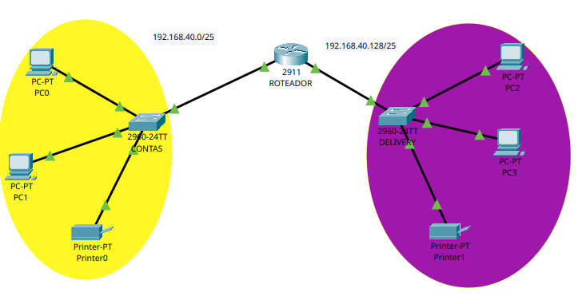
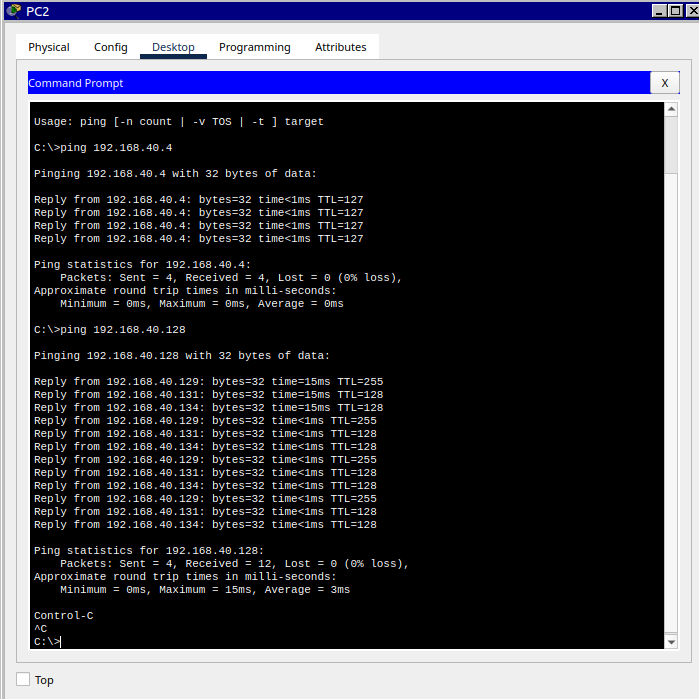

# packet-tracer-lab-01

# Lab de Redes — Segmentação com Roteador e Switches (Cisco Packet Tracer)

## Objetivo
Simular uma rede com dois departamentos (Contas e Delivery) segmentados 
em sub-redes diferentes, interligados por um roteador Cisco 2911.

## Topologia

## Endereçamento IP
| Rede      | Faixa              | Dispositivos          |
|-----------|---------------------|------------------------|
| Contas    | 192.168.40.0/25     | PC0, PC1, Printer0     |
| Delivery  | 192.168.40.128/25   | PC2, PC3, Printer1     |

## O que foi configurado
- Sub-redes com máscara /25
- Roteamento entre as duas redes via roteador 2911
- Switches 2960-24TT para cada segmento
- Testes de conectividade (ping) entre hosts de redes diferentes

## Aprendizados
- Cálculo de sub-redes (VLSM)
- Configuração básica de interfaces em roteador Cisco
- Segmentação de rede por departamento

## Próximos passos
- Adicionar VLANs
- Implementar ACLs para controle de tráfego entre Contas e Delivery
- Configurar DHCP
